# Deploy production DigitalOcean + CapRover + Cloudflare


### Create DigitalOcean Droplet and configure Cloudflare

Create with CapRover Application
https://marketplace.digitalocean.com/apps/caprover

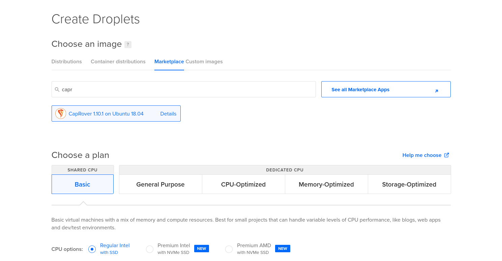

Configure DNS Record to DigitalOcean ip Droplet
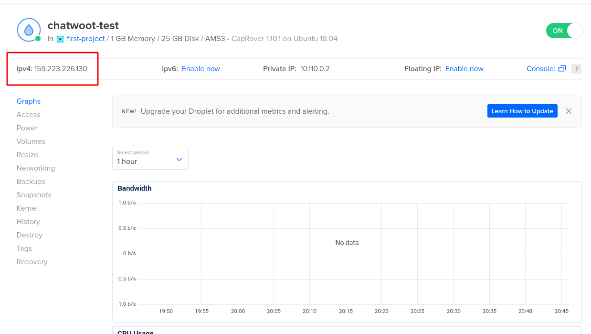
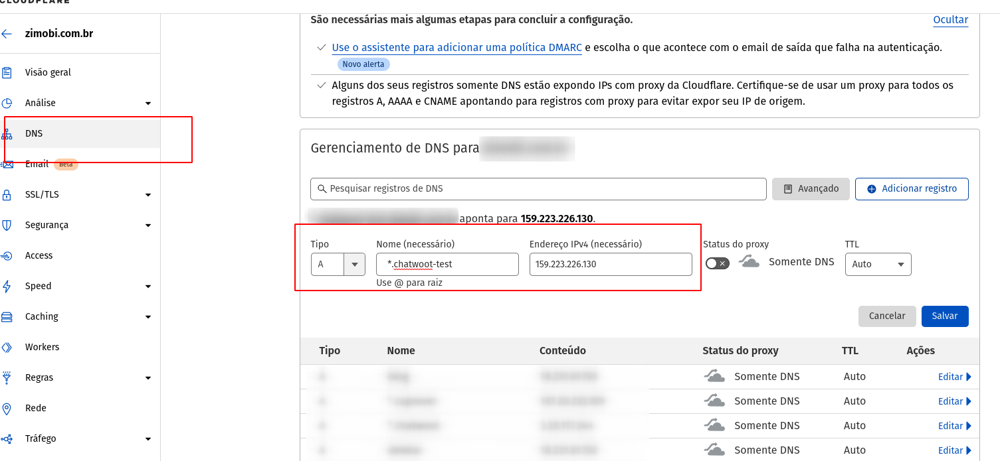

### Configure CapRover

Install CapRover CLI
```sh
npm install -g caprover
```


Then, run
```sh
caprover serversetup
```
Follow the steps and login to your CapRover instance. When prompted to enter the root domain, enter something.mydomain.com assuming that you set *.something.mydomain.com to point to your IP address in step.
Now you can access your CapRover from captain.something.mydomain.com

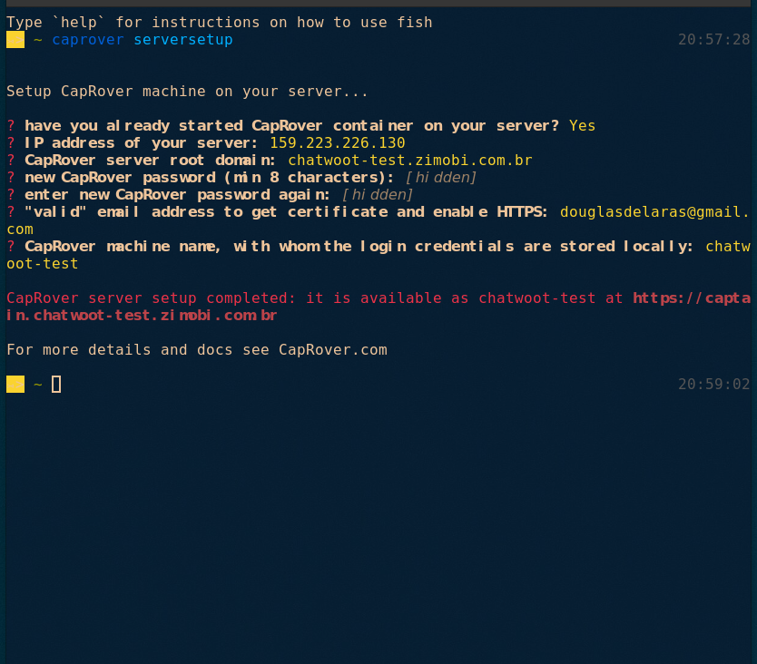


### Deploy applications

Access your CapRover from `captain.something.mydomain.com`, in this example `captain.chatwoot-test.mydomain.com`
Login with your password and select One-Click Apps
Select Template One Click Apps
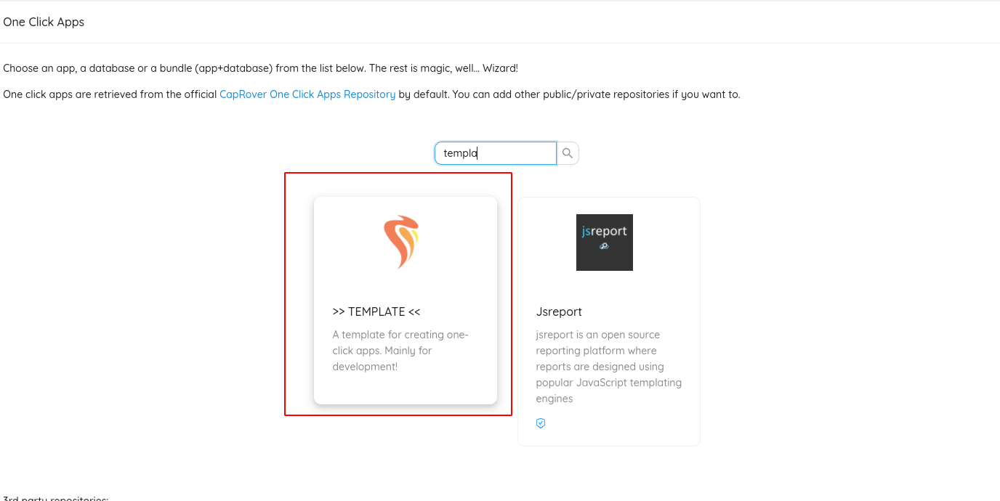

Use JSON configuration:

```
captainVersion: 4
services:
    $$cap_appname-server:
        image: douglara/wppconnect-server:$$cap_chatwoot_version
        restart: always
        environment:
            NODE_ENV: development
            NPM_CONFIG_PRODUCTION: false
            CONFIG: '{"secretKey":"$$cap_wpp_connect_server_secret","host":"http://$$cap_appname-server.$$cap_root_domain","port":"21465","startAllSession":false,"tokenStoreType":"file","webhook":{"url":null,"autoDownload":true,"uploadS3":false,"readMessage":true,"allUnreadOnStart":false,"listenAcks":true,"onPresenceChanged":true,"onParticipantsChanged":true},"archive":{"enable":false,"waitTime":10,"daysToArchive":45},"log":{"level":"error","logger":["console","file"]},"createOptions":{"whatsappVersion":null,"browserArgs":["--disable-web-security","--no-sandbox","--disable-web-security","--aggressive-cache-discard","--disable-cache","--disable-application-cache","--disable-offline-load-stale-cache","--disk-cache-size=0","--disable-background-networking","--disable-default-apps","--disable-extensions","--disable-sync","--disable-translate","--hide-scrollbars","--metrics-recording-only","--mute-audio","--no-first-run","--safebrowsing-disable-auto-update","--ignore-certificate-errors","--ignore-ssl-errors","--ignore-certificate-errors-spki-list"]},"mapper":{"enable":false,"prefix":"tagone-"},"db":{"mongodbDatabase":"tokens","mongodbCollection":"","mongodbUser":"","mongodbPassword":"","mongodbHost":"","mongoIsRemote":true,"mongoURLRemote":"","mongodbPort":27017,"redisHost":"","redisPort":19966,"redisPassword":"","redisDb":0}}'
        caproverExtra:
            containerHttpPort: '21465'
    $$cap_appname-postgres:
        image: postgres:12
        volumes:
            - $$cap_appname-postgres-data:/var/lib/postgresql/data
        restart: always
        environment:
            POSTGRES_USER: chatwoot
            POSTGRES_PASSWORD: $$cap_chatwoot_postgres_password
            POSTGRES_DB: chatwoot
        caproverExtra:
            notExposeAsWebApp: 'true'
    $$cap_appname-redis:
        volumes:
            - $$cap_appname-redis-data:/data
        restart: always
        environment:
            REDIS_PASSWORD: $$cap_chatwoot_redis_password
        caproverExtra:
            dockerfileLines:
                - FROM redis:alpine
                - CMD exec redis-server --requirepass "$$cap_chatwoot_redis_password"
            notExposeAsWebApp: 'true'
    $$cap_appname-web:
        restart: always
        environment:
            RAILS_ENV: production
            RAILS_LOG_TO_STDOUT: 'true'
            SECRET_KEY_BASE: $$cap_chatwoot_secret_key_base
            POSTGRES_HOST: srv-captain--$$cap_appname-postgres
            POSTGRES_DATABASE: chatwoot
            POSTGRES_USERNAME: chatwoot
            POSTGRES_PASSWORD: $$cap_chatwoot_postgres_password
            REDIS_URL: redis://srv-captain--$$cap_appname-redis:6379
            REDIS_PASSWORD: $$cap_chatwoot_redis_password
            INSTALLATION_ENV: caprover
            FRONTEND_URL: http://$$cap_appname-web.$$cap_root_domain
        caproverExtra:
            containerHttpPort: '3000'
            dockerfileLines:
                - FROM douglara/wpp-connect-chatwoot:$$cap_chatwoot_version
                - RUN chmod +x docker/entrypoints/rails.sh
                - ENTRYPOINT ["docker/entrypoints/rails.sh"]
                - EXPOSE 3000
                - CMD bundle exec rails db:chatwoot_prepare; bundle exec rails s -b 0.0.0.0 -p 3000
    $$cap_appname-worker:
        restart: always
        environment:
            RAILS_ENV: production
            RAILS_LOG_TO_STDOUT: 'true'
            SECRET_KEY_BASE: $$cap_chatwoot_secret_key_base
            POSTGRES_HOST: srv-captain--$$cap_appname-postgres
            POSTGRES_DATABASE: chatwoot
            POSTGRES_USERNAME: chatwoot
            POSTGRES_PASSWORD: $$cap_chatwoot_postgres_password
            REDIS_URL: redis://srv-captain--$$cap_appname-redis:6379
            REDIS_PASSWORD: $$cap_chatwoot_redis_password
            INSTALLATION_ENV: caprover
        caproverExtra:
            dockerfileLines:
                - FROM douglara/wpp-connect-chatwoot:$$cap_chatwoot_version
                - RUN chmod +x docker/entrypoints/rails.sh
                - ENTRYPOINT ["docker/entrypoints/rails.sh"]
                - CMD bundle exec sidekiq -C config/sidekiq.yml
            notExposeAsWebApp: 'true'
caproverOneClickApp:
    variables:
        - id: $$cap_chatwoot_version
          label: Chatwoot Version Tag
          description: Choose the latest version from https://hub.docker.com/r/douglara/wpp-connect-chatwoot/tags
          defaultValue: 1
        - id: $$cap_chatwoot_secret_key_base
          label: Chatwoot Secret Key Base
          description: The randomized string which is used to verify the integrity of signed cookies. Please use a string with more than 26 characters
          validRegex: /^[^\@]{26,}$/
        - id: $$cap_chatwoot_postgres_password
          label: Postgres Password
          description: Password must be at least 12 characters.  Please use a random string.
          validRegex: /^[^\@]{12,}$/
        - id: $$cap_chatwoot_redis_password
          label: Redis Password
          description: Password must be at least 12 characters. Please use a random string.
          validRegex: /^[^\@]{12,}$/
        - id: $$cap_wpp_connect_server_secret
          label: WPP Connect Server Secret
          description: Please use a random string.
    instructions:
        start: Open-source customer support SaaS alternative to Intercom, Drift, Crisp.
        end: >-
            Your Chatwoot instance is now successfully deployed.
            Refer https://www.chatwoot.com/docs/environment-variables/ for full list of environment variables available. Let us know if you have any queries through hello@chatwoot.com
    displayName: Chatwoot
    isOfficial: true
    description: Open-source customer support SaaS alternative to Intercom, Drift, Crisp
    documentation: 'Read more at: https://www.chatwoot.com/docs'
```

Configure apps variables
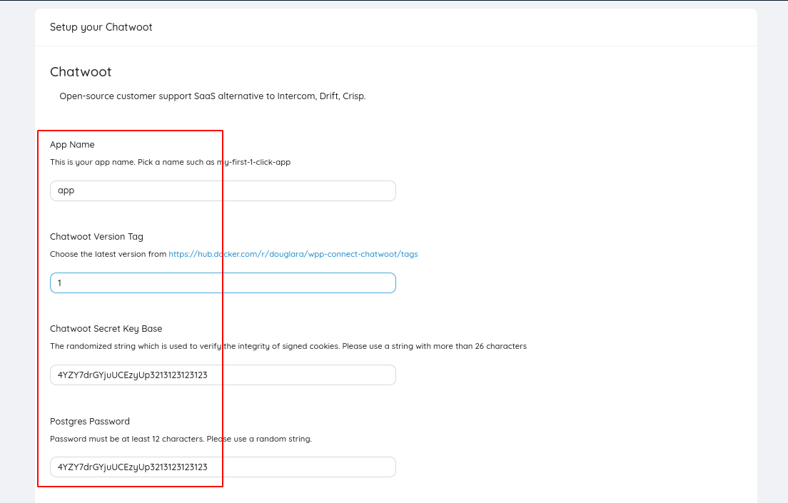

Waiting to create applications
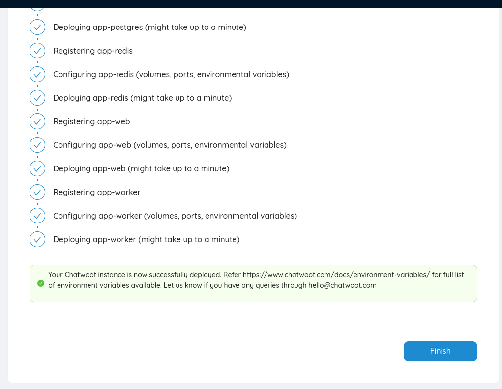

After create wait someone minutes to applications start and you can create your chatwoot account, access app-web application url

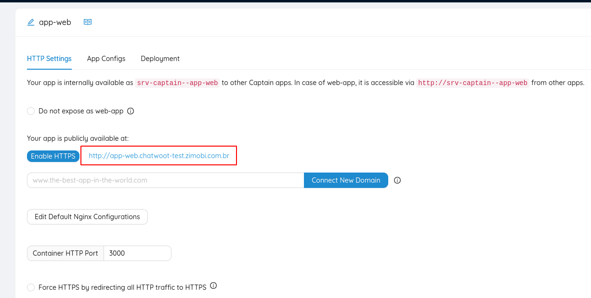

To connect on WPP Connect Server use admin painel with url:
`http://....-web.something.mydomain.com/super_admin`

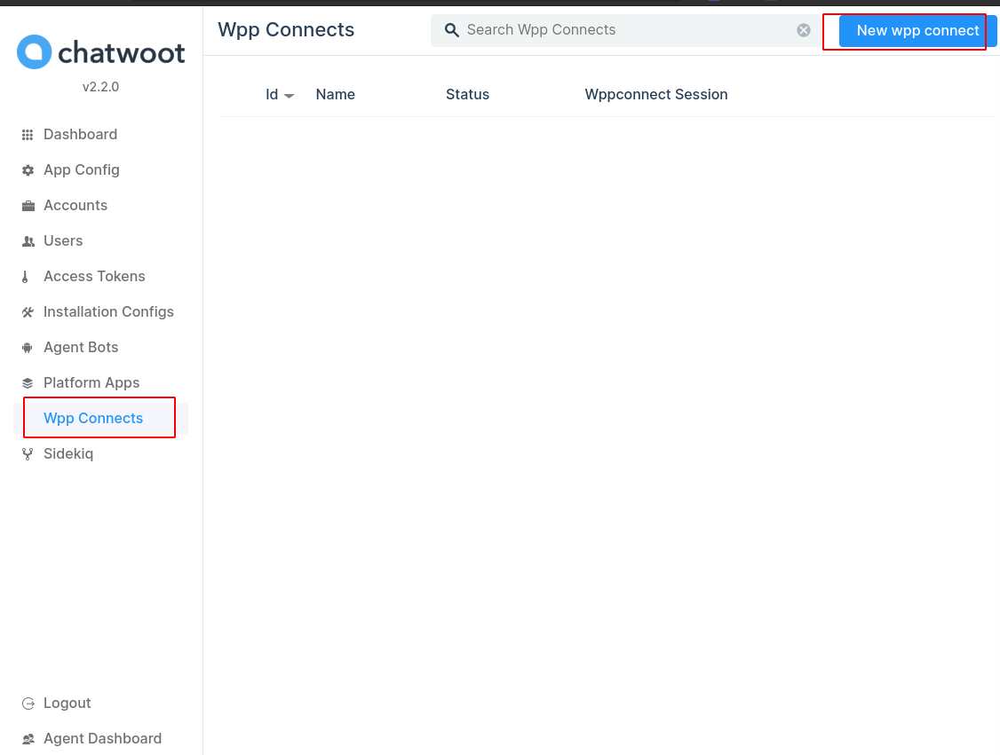

To create new connection setup:
```
    Name: Connection Name
    Status: active
    Wppconnect session: session-name
    Wppconnect token: 
    Wppconnect endpoint: http://srv-captain--app-server:21465
    Wppconnect secret: SECRET_CONFIGURED_ON_DEPLOY
```
Wppconnect endpoint may change depending on the name of the name you specified on deploy.

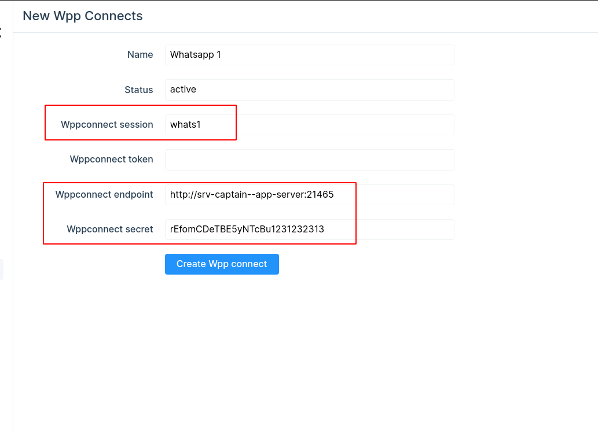


Click in connect and wait to pair QR Code
Open chatwoot frontend and wait sync messages

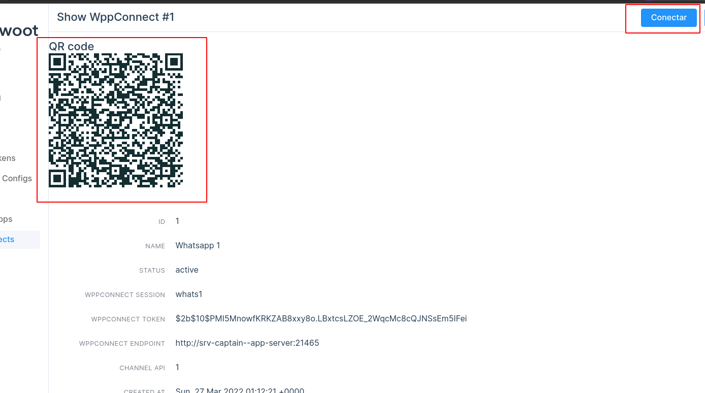

Active websocket support and https to chatwoot web app

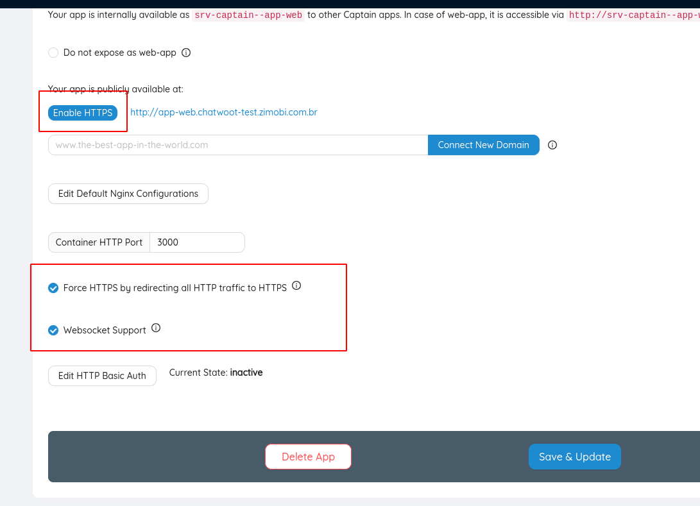
